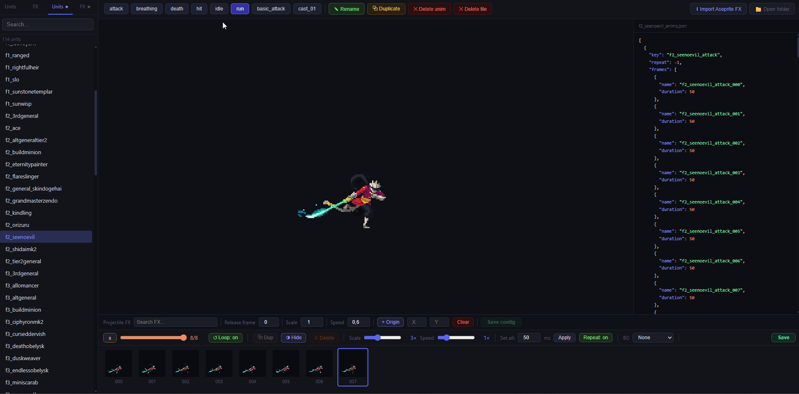

# Duelyst Animation Editor

A browser-based tool for viewing and editing Duelyst sprite animations, with a conversion pipeline to transform the original Cocos2d `.plist` spritesheets into a format compatible with Phaser 3 and Canvas 2D.

**[Live demo](https://torenciel.github.io/Duelyst-animation-editor/viewer.html)** — read-only preview with a selection of units and FX.



---

## Viewer features

### Tabs

| Tab     | Loads from        | Saves to          |
| ------- | ----------------- | ----------------- |
| Units   | `dist/`           | `dist-custom/`    |
| FX      | `dist-fx/`        | `dist-fx-custom/` |
| Units ★ | `dist-custom/`    | `dist-custom/`    |
| FX ★    | `dist-fx-custom/` | `dist-fx-custom/` |

### Animation bar

- Click animation name buttons to switch animations
- **✎ Rename** — rename the current animation
- **⧉ Duplicate** — clone the current animation under a new name
- **✕ Delete anim** — remove the current animation

### Frame editor

- **▶ / ⏸** — play/pause
- **Frame slider** — scrub through frames manually
- **⧉ Dup** — duplicate selected frame(s)
- **◑ Hide** — hide/show selected frame(s) during playback
- **✕ Delete** — remove selected frame(s)
- **Scale** — preview zoom (default 2×)
- **Speed** — playback speed multiplier
- **↺ Loop** — toggle looping for current session (does not save)
- **Repeat** — toggle `repeat` in the JSON (-1 loop / 0 once) — saves
- **BG** — select a background map image behind the sprite
- **Set all / Apply** — set every frame's duration to a fixed ms value
- **Save** — write changes to `dist-custom/`

### Frame selection

- Click a thumbnail to select it and freeze preview on that frame
- Shift+click to select a range
- Drag thumbnails left/right to reorder frames

### Keyboard shortcuts

| Key    | Action                          |
| ------ | ------------------------------- |
| Space  | Play / pause                    |
| Delete | Delete selected frame(s)        |
| ↑ / ↓  | Previous / next unit in list    |
| 1–9    | Switch to animation by position |

---

## Stack

| Layer          | Technology                                   |
| -------------- | -------------------------------------------- |
| Runtime        | Node.js (no npm packages — stdlib only)      |
| Server         | Native `node:http` module                    |
| Frontend       | Vanilla JavaScript (ES6 modules, no bundler) |
| Rendering      | Canvas 2D API                                |
| Input format   | Cocos2d `.plist` spritesheets + PNGs         |
| Output format  | JSON atlas + JSON animation definitions      |
| Import support | Aseprite JSON Hash exports                   |

The entire tool runs without installing any dependencies — `node server.js` is the only command needed after placing your assets.

---

## Project structure

```
├── src/                       # Viewer app — ES modules loaded directly in browser
│   ├── index.js               #   Entry point: loads manifest, wires components
│   ├── state.js               #   Central application state
│   ├── animation-manager.js   #   Animation state and playback logic
│   ├── sprite-animator.js     #   Frame-stepping engine (Canvas 2D)
│   ├── canvas.js              #   Low-level canvas rendering
│   ├── frame-editor.js        #   Frame manipulation UI (reorder, dup, delete)
│   ├── controls.js            #   Toolbar buttons and UI bindings
│   ├── item-loader.js         #   Loads unit/FX manifests and assets
│   ├── projectile.js          #   Projectile config and canvas marker
│   ├── aseprite-import.js     #   Aseprite JSON Hash import handler
│   ├── persistence.js         #   Save to dist-custom / dist-fx-custom
│   ├── keyboard.js            #   Keyboard shortcut handlers
│   ├── json-display.js        #   Live JSON inspector panel
│   ├── dom.js                 #   DOM helper utilities
│   └── config.js              #   Config loading utilities
│
├── viewer.html                # Single-page app entry point
├── viewer.css                 # All styles
├── server.js                  # Static file server + save API endpoint
├── config.json                # Paths to Duelyst source assets (user-edited)
│
├── convert-units-plist.js     # Batch converter: .plist units → dist/
├── convert-fx.js              # Batch converter: .plist FX → dist-fx/
├── make-manifest.js           # Generates dist/manifest.json index
│
├── demo-assets/               # Hand-picked assets for the GitHub Pages demo (committed)
│   ├── dist/                  #   Demo units
│   ├── dist-fx/               #   Demo FX
│   └── background/            #   Demo backgrounds
│
├── dist/                      # Converted unit spritesheets (generated, not committed)
├── dist-custom/               # Edited/custom units — viewer saves here
├── dist-fx/                   # Converted FX spritesheets (generated, not committed)
├── dist-fx-custom/            # Custom FX + Aseprite imports
└── background/                # Map background PNGs for viewer preview
```

---

## Setup

### Requirements

- Node.js (no npm packages needed)
- Source assets from the open-source [Duelyst repo](https://github.com/88dots/duelyst)

### Installation

1. Clone this repo
2. Edit `config.json` with the paths to your local Duelyst source assets:

```json
{
  "unitsDir": "/path/to/duelyst/app/resources/units",
  "fxDir": "/path/to/duelyst/app/resources/fx"
}
```

3. Run the converter scripts to populate `dist/` and `dist-fx/`
4. Start the server and open the viewer

---

## Converter scripts

Convert all source `.plist` spritesheets to the output format:

```bash
# Convert all units → dist/
node convert-units-plist.js

# Convert all FX → dist-fx/
node convert-fx.js

# Regenerate dist/manifest.json (required after adding new units)
node make-manifest.js
```

> **Naming rule:** the `_anims` suffix must always be last.
> ✓ `neutral_metaltooth_recolor_anims.json`
> ✗ `neutral_metaltooth_anims_recolor.json`

---

## Running the viewer

```bash
node server.js
```

Then open `http://localhost:3000` in your browser.

---

## Projectile config

Units that fire projectiles store a config entry in their `_anims.json`:

```json
{
  "projectileKey": "fx_arrow_lyonar",
  "releaseFrame": 7,
  "offsetX": 25,
  "offsetY": -12,
  "projectileSpeed": 0.6
}
```

### Setting up in the viewer

1. Select a unit and switch to its attack animation
2. The **Projectile FX** panel appears above the frame toolbar
3. Search and select the FX to use as the projectile
4. Step to the frame where the projectile should fire
5. Click **+ Origin**, then click the canvas where the projectile spawns — release frame auto-fills
6. Drag the marker to reposition it
7. Adjust **Speed** as needed
8. Click **Save config**

---

## Importing Aseprite FX

1. Export from Aseprite: **File → Export Sprite Sheet** → JSON Hash format
2. In the viewer, click **⬇ Import Aseprite FX**
3. Enter the target name (e.g. `fx_myeffect`)
4. Toggle **Repeat: loop / once**
5. Drop the Aseprite `.json` file (and optionally the `.png`) onto the drop zone
6. Click **↑ Save to dist-fx-custom**

---

## Output format

Each unit or FX entry consists of three files:

**`{name}.png`** — spritesheet, copied as-is from source.

**`{name}.json`** — atlas:

```json
{
  "frames": {
    "unit_attack_000": { "frame": { "x": 0, "y": 0, "w": 120, "h": 120 } },
    "unit_attack_001": { "frame": { "x": 120, "y": 0, "w": 120, "h": 120 } }
  }
}
```

**`{name}_anims.json`** — animation definitions:

```json
[
  {
    "key": "unit_attack",
    "repeat": 0,
    "frames": [
      { "name": "unit_attack_000", "duration": 50 },
      { "name": "unit_attack_001", "duration": 50 }
    ]
  }
]
```

- `repeat: -1` = loop, `repeat: 0` = play once
- `duration` is in milliseconds per frame

---

## Adding a recolored unit

1. Edit the spritesheet PNG (recolor in Aseprite, Photoshop or similar)
2. Copy `dist/{original_name}.json` → `dist-custom/{original_name}_recolor.json` and rename every frame key inside from `{original_name}_*` to `{original_name}_recolor_*`
3. Copy `dist/{original_name}_anims.json` → `dist-custom/{original_name}_recolor_anims.json` and rename every frame `name` value and the animation `key` values the same way
4. Place the recolored `.png` and both `.json` files into `dist-custom/`
5. The unit appears in the Units ★ tab as `{original_name}_recolor`

